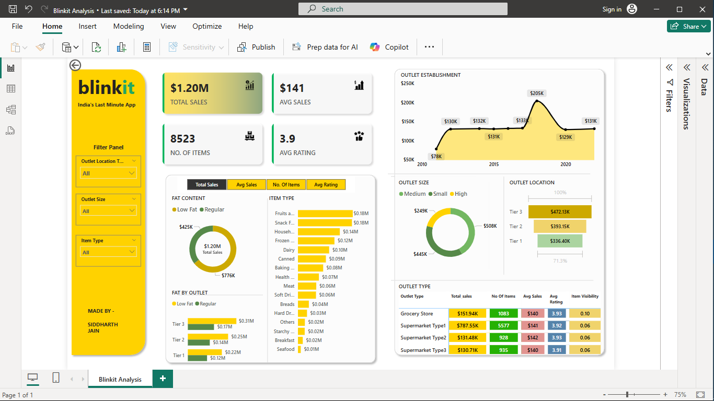

# 📦 Blinkit Data Analyst Project

This project is a detailed data analysis of Blinkit – India's last-minute delivery app. The analysis focuses on understanding item sales, outlet performance, and customer ratings using **Python in Jupyter Notebook** for data wrangling and **Power BI** for dashboard visualization.

---

## 🧰 Tools & Technologies Used

- **Python** – Data Cleaning and Exploration
- **Jupyter Notebook** – Data Analysis
- **Power BI** – Interactive Dashboard Visualization
- **Libraries:** pandas, matplotlib

---

## 📌 Objective

To extract actionable business insights from Blinkit's sales dataset by:

- Analyzing sales trends and patterns across different outlet types and locations
- Understanding the impact of item characteristics like fat content, type, and visibility
- Identifying high-performing categories and locations to support data-driven decisions

---

## 📊 Power BI Dashboard Overview

The Power BI report provides a quick and interactive overview of key business metrics:

💰 Total Sales 
🛍️ Number of Items 
📉 Avg Sales per Item 
⭐ Avg Rating

### 🔎 Key Features:
- Filter Panel: Outlet type, outlet size, item type
- Line Chart: Outlet establishment year vs sales
- Pie Charts: Sales by fat content and outlet size
- Bar Charts: Sales by location tier and item type
- Detailed KPI Table: Outlet-wise metrics (total sales, ratings, item count)

🖼️ *Sample Dashboard Screenshot:*  

---

## 📘 Jupyter Notebook Summary

Performed EDA and data preprocessing steps in Python:

### 🔍 Key Steps:
- Cleaned missing values and formatted data types
- Visualized distribution of fat content, outlet sales, item types, and ratings
- Identified trends between outlet attributes and sales performance

---

## 📈 Insights & Takeaways

- 🏪 **Supermarket Type 1** has the highest sales: $9.63K
- 🌍 **Tier 3 cities** lead with the highest revenue: $6.6K
- 🥣 **Breakfast items** generate the most sales
- 🥛 **Regular fat items** outperform low-fat in most tiers
- 📊 **Outlet establishment year** has a noticeable trend with sales growth over time

---

## 📁 Files in Repository

- `Blinkit Analysis.ipynb` – Data analysis and EDA in Python
- `Blinkit Analysis.pbix` – Visual summary of insights
- `Blinkit Dataset`

---

## 👤 Author

**Siddharth Jain**  

